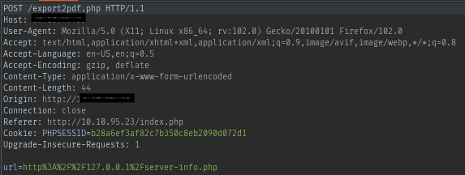
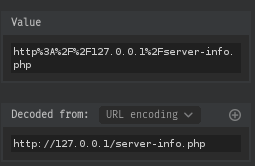

<h1>TryHackMe - Surfer</h1>

I there were a lot of things that i tried but were not helpful and including them will only waste  your time so i will only include the steps that showed me any result

<ol>
    <li>
        <h3>Port-Scanning:</h3>
         
        Starting with rust scan we can see that only two ports are open. 
        Trying to brute force SSH is useless so lets checkout the webpage.
    </li> 
    <li>
        <h3>WebPage:</h3>
         
        Were land on this login.php page. 
        Let's try some default credentials before using sqlmap or hydra. 
    </li> 
    <li>
        <h3>LogIn Page:</h3>
         
        One of those default credentials worked and now we are logged in.
    </li> 
    <li>
        <h3>Index Page:</h3>
         
        I was going through the page and found this. if there was anything on this page that could halp me was this option. 
        So i search "Export pdf vulnerability" and found <a href="https://inonst.medium.com/export-injection-2eebc4f17117">this</a>. 
        The first step was to capture and monitor the http request.
    </li> 
    <li>
        <h3>HTTP request:</h3>
          
        I intercepted the request using burp and url-decoded the <code>url</code> parameter. 
        So, we can see that it has Internal Network Exposure(SSRF) vulnerability. 
        I thought of internal port scanning like the post from Inon suggested but i don't know how to do it so i had another idea. 
        I wanted to bruteforce and see if there are any other pages like <code>server-info.php</code> that we could access on that internal network. 
        I tried some basic ones but it didn't help so lets use ffuf and see what we get.
    </li> 
    <li>
        <h3>FFUF:</h3>
         
        I grabbed all the important stuff from the burp request and used them in ffuf command and i found these files and folders. 
        This machine has <code>port 22</code> and since it is a CTF, my next move is to find any file which might contain the login credentials for SSH. 
        I will ffuf all the folders for intresting files.
    </li> 
    <li>
        Flag: 
         
        Instead of finding the login credentials for SSH, i found the flag. 
        I can't include the files location because i want this writeup to be accepted so all i can say is that i found an intresting file inside a folder. 
        i then used that files location in the <code>url</code> parameter by intercepting the request in burp and forwarded it. The file i received as pdf had the flag.
    </li>
</ol>