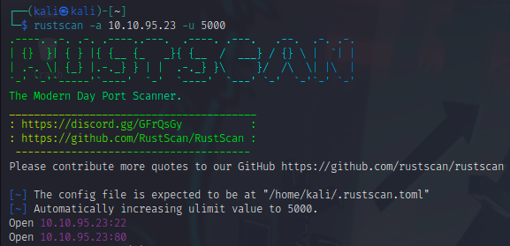
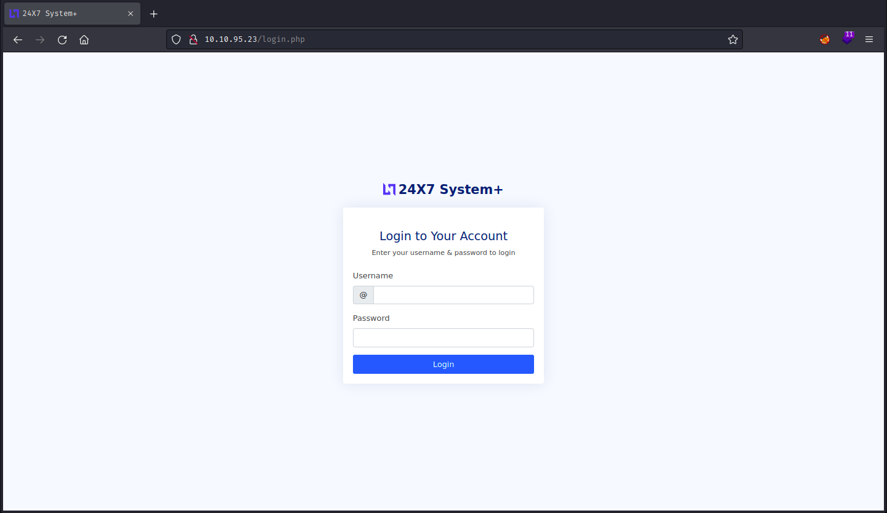
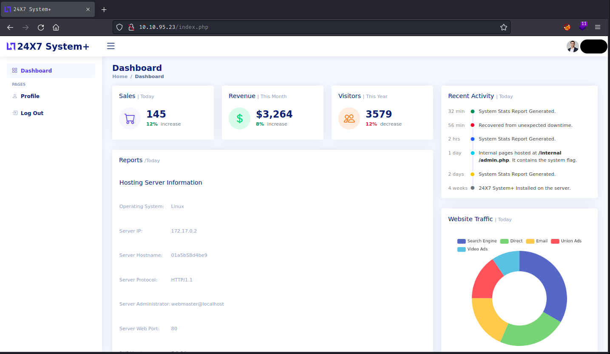
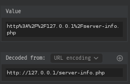
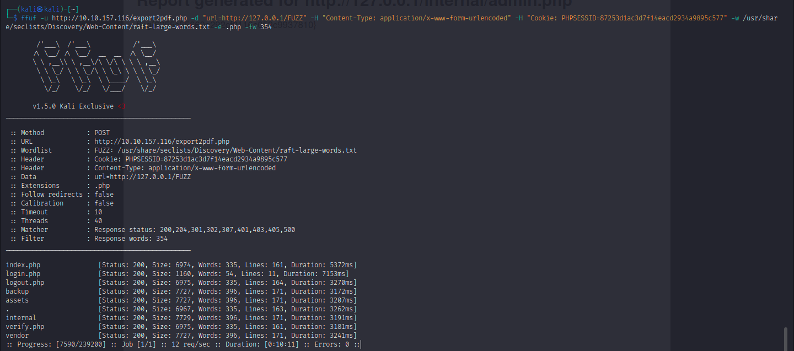
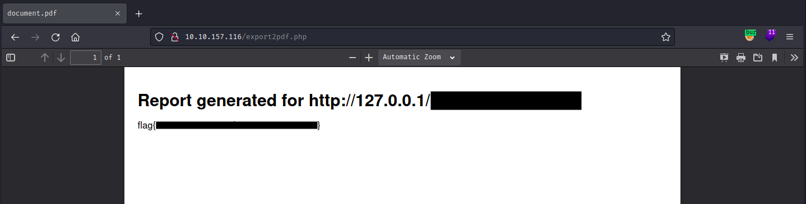

<h1>TryHackMe - Surfer</h1>

There were a lot of things that i tried but were not helpful and including them was only a waste  of time. So, i will only include the steps that showed me any result

<ol>
    <li>
        <h3>Port-Scanning:</h3>
         
        Starting with <code>rustscan</code> we can see that only two ports are open. 
        Trying to brute force SSH mostly fails. So, let's checkout the webpage first.
    </li> 
    <li>
        <h3>WebPage:</h3>
         
        We land on this <code>login.php</code> page. 
        Let's try some default credentials before using <code>sqlmap</code> or <code>hydra</code>. 
    </li> 
    <li>
        <h3>LogIn Page:</h3>
         
        One of those default credentials worked and now we are logged in.
    </li> 
    <li>
        <h3>Index Page:</h3>
         
        I was going through the page and found this. if there was anything on this page  
        that could help me, was this option. So, i search <code>Export pdf vulnerability</code> and  
        found <a href="https://inonst.medium.com/export-injection-2eebc4f17117">this</a>. This is a medium post by <strong>Inon Shkedy</strong> where he explains <code>Export Injection</code>.
         The first step was to capture and monitor the http request.
    </li> 
    <li>
        <h3>HTTP request:</h3>
          
        I intercepted the request using <code>burpsuite</code> and url-decoded the <code>url</code> parameter. So, we can see that  it has Internal Network Exposure(SSRF) vulnerability.
        I thought of internal port scanning like the  post from Inon suggested but i don't know how to do it so i had another idea.
        I wanted to  bruteforce and see if there are any other pages like <code>server-info.php</code> that we could access on  that internal network.
        I tried some basic ones but it didn't help so lets use ffuf and see what we get.
    </li> 
    <li>
        <h3>FFUF:</h3>
         
        I grabbed all the important stuff from the burp request and used them in ffuf command and  i found these files and folders. This machine has <code>port 22</code> and since it is a CTF, my next move  is to find any file which might contain the login credentials for SSH. 
        I will ffuf all the folders for intresting files.
    </li> 
    <li>
        <h3>Flag:</h3>
         
        Instead of finding the login credentials for SSH, i found the flag. I can't include the files  location because i want this writeup to be accepted so all i can say is that i found an  intresting file inside a folder. i then used that files location in the <code>url</code> parameter by  intercepting the request in burp and forwarded it. The file i received as pdf had the flag.
    </li>
</ol>