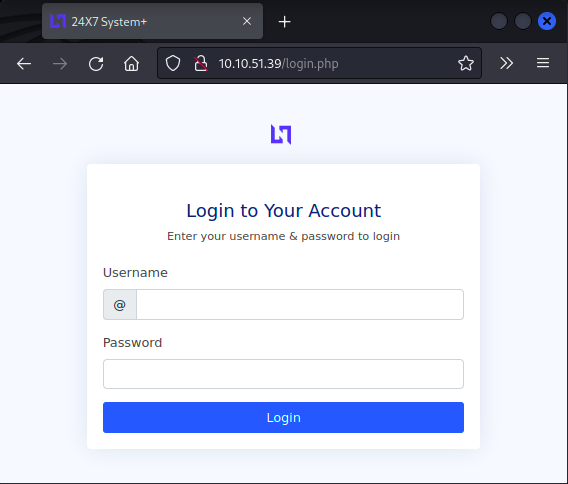
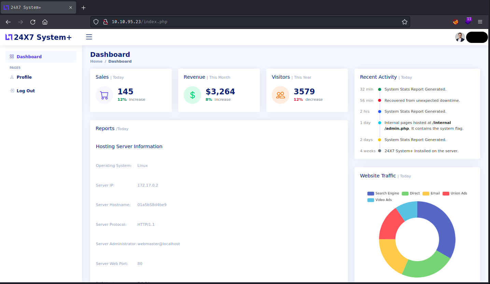
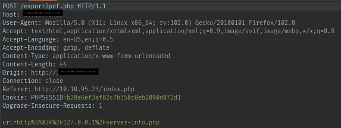

<h1>TryHackMe - Surfer</h1>

<ul>
    <li>
        <strong>Step 1 :</strong> Rustscan 
        <ul>
            <code>10.10.51.39:22</code> SSH 
            <code>10.10.51.39:80</code> http
        </ul>
    </li> 
    <li>
        <strong>Step 2 :</strong> Checking WebApplication (because bruteforcing ssh won't get us anywhere).
        <ul>
            
        </ul>
    </li> 
    <li>
        <strong>Step 3 :</strong> Brute forcing login page. 
        <ul>
            Trying out some default credentials. 
             
            One of them worked.
        </ul>
    </li> 
    <li>
        <strong>Step 4 :</strong> Back to reconnaissance. 
        <ul>
            <li>Export to pdf looks intresting.</li>
            <li>Searching google for <strong>export to pdf</strong> vulnerability.</li>
            <li>Searching that led me to <a href="https://inonst.medium.com/export-injection-2eebc4f17117">this</a> medium post by <strong>Inon Shkedy.</strong></li>
        </ul>
    </li> 
    <h2>Following his lead.</h2>
    <li>
        <strong>Step 5 :</strong> Monitoring the request.
        <ul>
             
            Looking at the <code>url</code> parameter after decoding it, we can say that <code>Internal Network Exposure(SSRF)</code> vulnerability exists on this server.
            It also made me think if i can read other files or not.
            I am looking for a file containing credential for ssh, ssh private key or anything that can help me get a foothold.
        </ul>
    </li> 
    <li>
        <strong>Step 6 :</strong> Fuzzing for other files.
        <ul>
            
        </ul>
    </li> 
    <li>
        <strong>Step 7 :</strong> Found the flag.
        <ul>
            
        </ul>
    </li> 
    <h2>
        Tried to get a foothold for a long time so i am leaving this here.  
        Solved 😂
    </h2>
</ul>