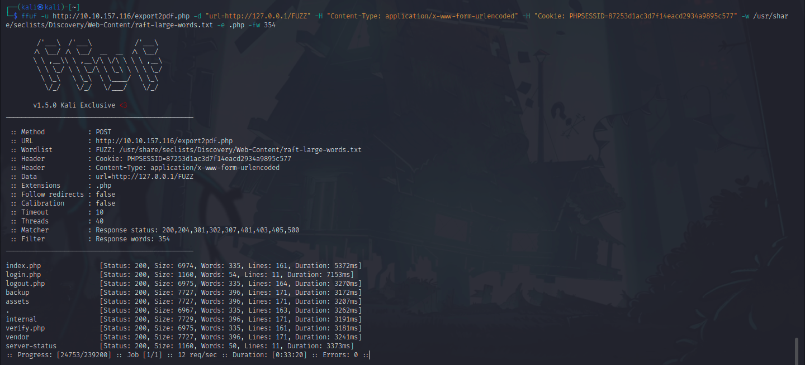

<h1>TryHackMe - Surfer</h1>

    There were a few things that i tried but were they not helpful. Including them  
    was only a waste of time. So, i will only include the steps that showed me any helpful result.

<ol>
    <li>
        <h3>Port-Scanning:</h3>
         
        Starting with <code>rustscan</code>. We can see that only two ports are open. 
        Trying to brute force SSH mostly fails. So, let's checkout the webpage first.
    </li> 
    <li>
        <h3>WebPage:</h3>
         
        We land on this <code>login.php</code> page. 
        Let's try some default credentials before using <code>sqlmap</code> or <code>hydra</code>. 
    </li> 
    <li>
        <h3>LogIn Page:</h3>
         
        One of those default credentials worked and now we are logged in.
    </li> 
    <li>
        <h3>Index Page:</h3>
         
        I was going through the page and found this option. If there was anything on this page  
        that could help me, was this option. So, i searched <code>Export pdf vulnerability</code> and  
        found <a href="https://inonst.medium.com/export-injection-2eebc4f17117">this</a>. This is a medium post by <strong>Inon Shkedy</strong> where he explains <code>Export Injection</code>.
         The first step was to capture and monitor the http request.
    </li> 
    <li>
        <h3>HTTP request:</h3>
          
        I intercepted the request using <code>burpsuite</code> and url-decoded the <code>url</code> parameter. We  
        can see that it has <code>Internal Network Exposure(SSRF)</code> vulnerability. I thought of  
        internal port scanning like the post from <strong>Inon</strong> suggested but i don't know how to do  
        it so i had another idea. I wanted to bruteforce and see if there are any other pages like  
        <code>server-info.php</code> that we could access on that internal network. I tried some basic ones  
        but they weren't helpful. So, let's use ffuf and try to find other files.
    </li> 
    <li>
        <h3>FFUF:</h3>
         
        I grabbed the header for <code>Content-Type</code> and <code>Cookie</code> from the burpsuite request  
        we intercepted and used them in ffuf command which you can see in the image. You might have noticed that  
        my machine ip has changed and that's because my 1 hour was over and i forgot to extend it. 
        So, i found these files and folders. This machine has <code>port 22</code> open and since it is  
        a CTF, my next move is to find any file which might contain the login credentials for SSH. 
        I will ffuf all the folders for intresting files.
    </li> 
    <li>
        <h3>Flag:</h3>
         
        Instead of finding the login credentials for SSH, i found the flag. I can't include the files  
        location because i want this writeup to be accepted. All i can say is that i found an  
        intresting file inside a folder. i then used that files location in the <code>url</code> parameter  
        by intercepting the request in burp and forwarded it. The file i received back as pdf had the flag.
    </li>
</ol>
<h1>Done!</h1>